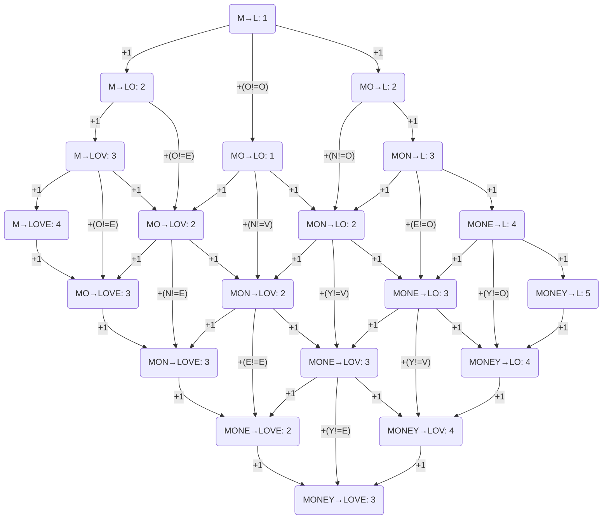
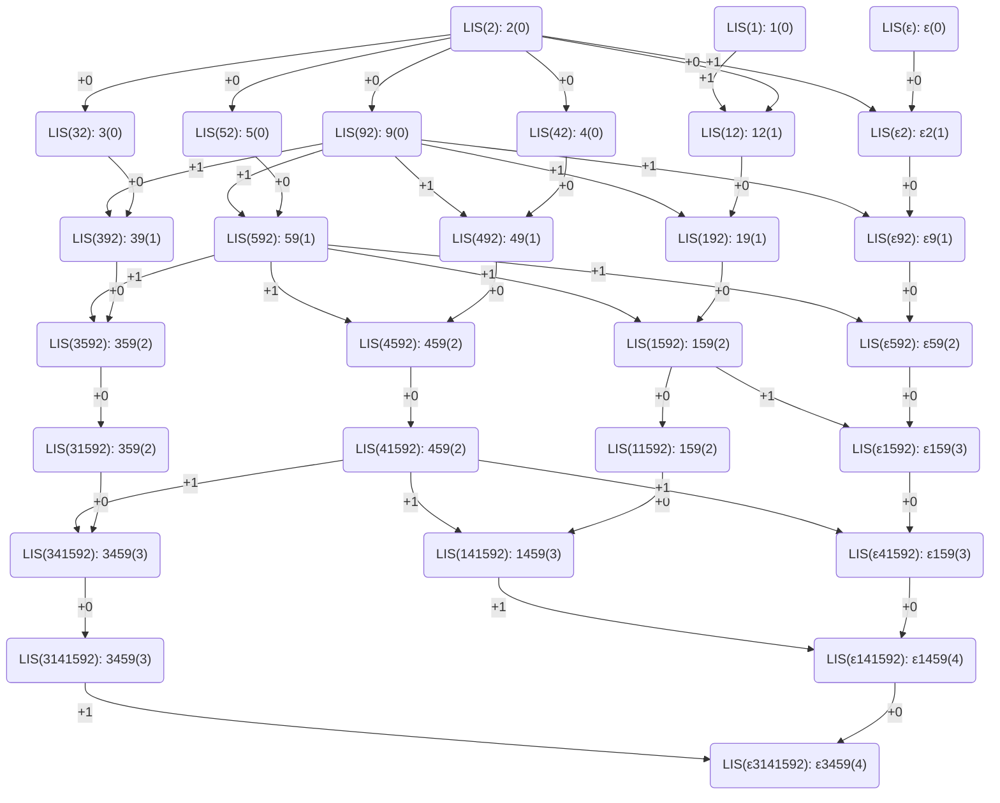

# 動的計画法（依存関係の可視化）

## 編集距離

`MONEY`を`LOVE`に変身させる場合で、編集距離の依存関係をフローチャートで示す。なお、最短距離を求めるタスクを考え、複数の矢印がある場合は最小の値を取る。

## 最長部分増加列

`3141592`の最長部分増加列（longest increasing subsequence）を求める際の依存関係をフローチャートで示す。描いてから気づいたけど、超見づらいので（依存関係が一方通行なんだな）という雰囲気だけ感じてください。かっこ内の数字は増加数、εは番兵である。矢印が2本ある場合、増加数が多くなる方を取る。

