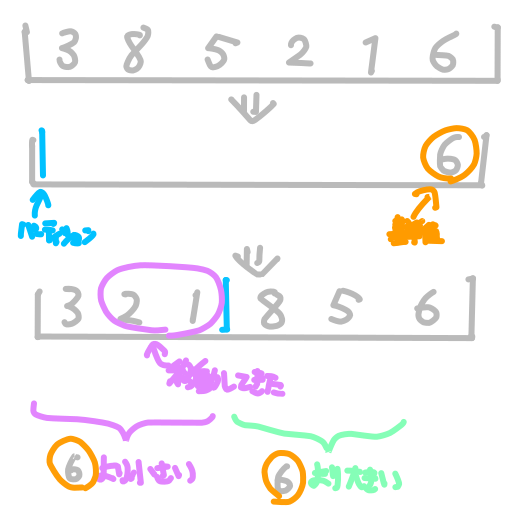

# [プログラミングコンテスト攻略のためのアルゴリズムとデータ構造](https://amzn.to/3QAHDSk)

## 2章 アルゴリズムと計算量

時間計算量と領域計算量について。領域計算量は空間計算量とも言う。

## 5章 探索

### 番兵

- `for`ループまたは`while`ループで、探索のための比較以外に終了条件の判定を行うことが面倒であるため、リストの最後に目的のデータをダミーで入れておく。
- Pythonでループを実装する場合や、TypeScriptで`find`などを用いる場合、勝手に最後まで探索してくれるので考慮不要。

### ハッシュの衝突

アルゴリズム図鑑で紹介されているチェーン法の他に、オープンアドレス法による対応がある。オープンアドレス法には、線形走査法とダブルハッシュ法がある。

- 線形走査法
  - 衝突が発生した場合、その1つ後ろの位置を格納箇所とする
  - 線形走査法・オープンアドレス法の両方に言えるが、いずれはハッシュ表が満杯になる。
- ダブルハッシュ法
  - ハッシュが衝突したら、引数に衝突回数を加えて再度ハッシュを求める。

[ハッシュ探索②（オープンアドレス法） | Programming Place Plus　アルゴリズムとデータ構造編【探索アルゴリズム】　第７章](https://programming-place.net/ppp/contents/algorithm/search/007.html#linear_probing)

## 7章 高等的整列

### パーティション

### クイックソート

再帰的にパーティションを行う。

### 計数ソート

[計数ソート | アルゴリズムビジュアル大事典
](https://yutaka-watanobe.github.io/star-aida/1.0/algorithms/counting_sort/print.html)を参照。

## 10章 ヒープ

- 最小ヒープは、親が子よりも小さく、根が最小になるヒープ。単にヒープといえば最小ヒープ。
- 最大ヒープはその逆となる。

## 参考

- [プログラミングコンテスト攻略のためのアルゴリズムとデータ構造](https://amzn.to/3QAHDSk)
- [アルゴリズム | ともめも](https://www.tomotaku.com/category/algorithm/)
