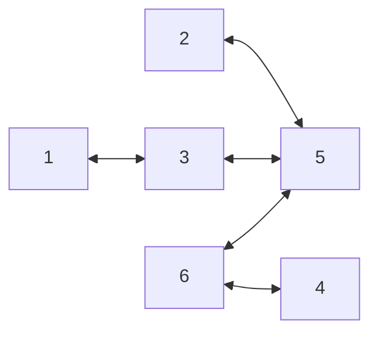

# 2016年度 創造情報学 第2問

## (1)

### 経路表が収束するまでに必要な時間

3分

### 1分ごとのノード6の経路表

0分

| 宛先ノード | ホップ数   | ネクストホップ |
| ---------- | ---------- | -------------- |
| 6          | h(6,6) = 0 | -              |

1分

| 宛先ノード | ホップ数   | 次の隣接ノード |
| ---------- | ---------- | -------------- |
| 6          | h(6,6) = 0 | -              |
| 5          | h(6,5) = 1 | 5              |
| 4          | h(6,4) = 1 | 4              |

2分

| 宛先ノード | ホップ数   | 次の隣接ノード |
| ---------- | ---------- | -------------- |
| 6          | h(6,6) = 0 | -              |
| 5          | h(6,5) = 1 | 5              |
| 4          | h(6,4) = 1 | 4              |
| 3          | h(6,3) = 2 | 5              |
| 2          | h(6,2) = 2 | 5              |

3分

| 宛先ノード | ホップ数   | 次の隣接ノード |
| ---------- | ---------- | -------------- |
| 6          | h(6,6) = 0 | -              |
| 5          | h(6,5) = 1 | 5              |
| 4          | h(6,4) = 1 | 4              |
| 3          | h(6,3) = 2 | 5              |
| 2          | h(6,2) = 2 | 5              |
| 1          | h(6,1) = 3 | 3              |

## (2)

## (3)

問題文の遅延をRTTを考える。（これは衛星回線のRTTが500msであることとも整合的）

ボトルネックであるノード5-2間の通信を考える。帯域幅が1Mbpsのため、遅延501msあたりの容量は501Kbitsとなる。パケットは8Kbitsのため、容量より小さい。よって、パケットの往復速度は遅延と等しい。

ノード6, ノード5, ノード2の遅延の合計は501ms。これを1000往復するため、T=5.01秒となる。

## (4)

TCPにおけるウィンドウ制御を導入する。具体的には、受信を知らせるパケットが返ってくるまでの間、連続でファイルを分割したパケットを送信すれば良い。受信を知らせるパケットには最後に受信したパケットのシーケンス番号を含めることで、送信側はどのパケットまでを受け取ったか = どのパケットまでは再送に備えなくてよいかが分かる。その分、新たにパケットを送れば良い。

連続して送信するパケット数の上限を計算する。(3)にて遅延あたりのボトルネックの容量（帯域遅延積）を計算した。帯域遅延積まではパケットを連続送信して良いから、501Kbits / 8Kbits = 62パケットまでは連続で送信できる。

## (5)

1. コストの計算にあたって、ホップ数の代わりに遅延を用いる。それによって、例えばノード6-2間の通信では、衛星回線のL5ではなく、ノード4を経由して広域地上線のL4を通る。
2. 各ノード間の接続トポロジー情報と辺のコストのデータベースを作り、全てのノードに同一のデータベース情報を共有する。各ノードは、ダイクストラ法などで自分以外のノードへの最適な経路を計算する。
