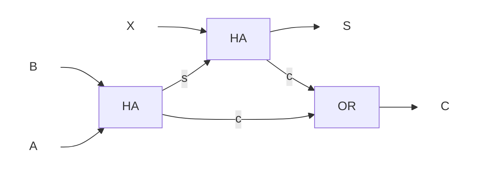

# 2017年度 創造情報学 第2問

## (1)

(省略)

## (2)

(省略)

## (3)

| A   | B   | X   | S   | C   |
| --- | --- | --- | --- | --- |
| 0   | 0   | 0   | 0   | 0   |
| 0   | 0   | 1   | 1   | 0   |
| 0   | 1   | 0   | 1   | 0   |
| 0   | 1   | 1   | 0   | 1   |
| 1   | 0   | 0   | 1   | 0   |
| 1   | 0   | 1   | 0   | 1   |
| 1   | 1   | 0   | 0   | 1   |
| 1   | 1   | 1   | 1   | 1   |

## (4)

## (5)

各ビットごとに全加算器を設ける。ただしn>1ビットのとき、n-1ビット目の加算器の出力Cをnビット目の入力Xに接続する。

## (6)

(省略)

## (7)

(省略)

## (8)

減算を、引く数の2の補数の加算として捉える。加算か減算かを伝える入力を1つ用意し、加算なら1、減算なら0が入力されるとする。減算なら引く数を反転させ、かつ最下位ビットの桁上りの形で1を足すことで、引く数を2の補数にする。

(回路図省略)

## (9)

(省略)
