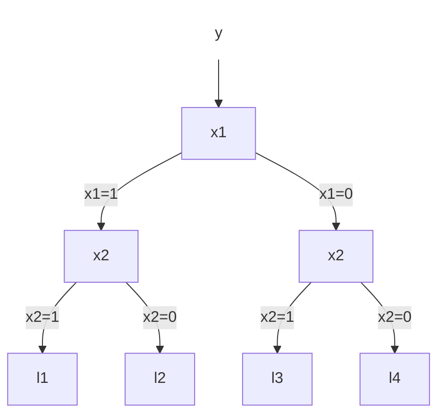

# 2018年度 創造情報学 第1問

## (1)

(省略)

## (2)

誤差関数を偏微分し、導関数を求める。

$$
\begin{align}
& \frac{\partial}{\partial\theta}\sum_{t:x_1=1}(y(t)-\theta)^2 \\
=& -2 \sum_{t:x_1=1}(y(t)-\theta) \\
=& -2 (\sum_{t:x_1=1}y - \text{len}(x_1=1)\theta)
\end{align}
$$

導関数を0と置いて方程式を解く。

$$
\begin{align}
-2 (\sum_{t:x_1=1}y - \text{len}(x_1=1)\theta) &= 0 \\
3 - 4\theta &= 0 \\
\theta &= \frac{3}{4}
\end{align}
$$

## (3)

i = 1

## (4)

次の通り。ただし、$x_1=1$の次は$x_2, x_3, x_4$のいずれで分割しても精度は変わらない。

## (5)

(省略)

## (6)

(未回答)
