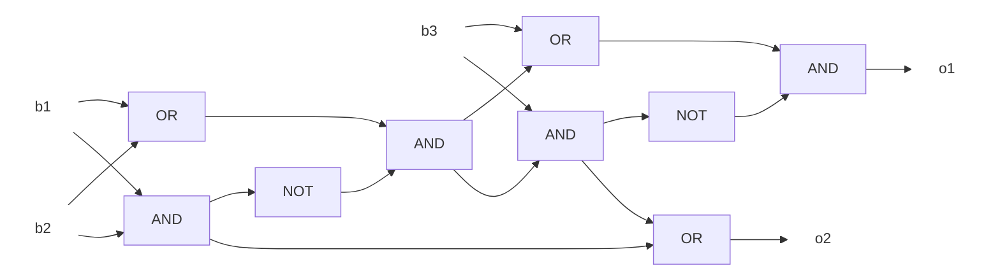
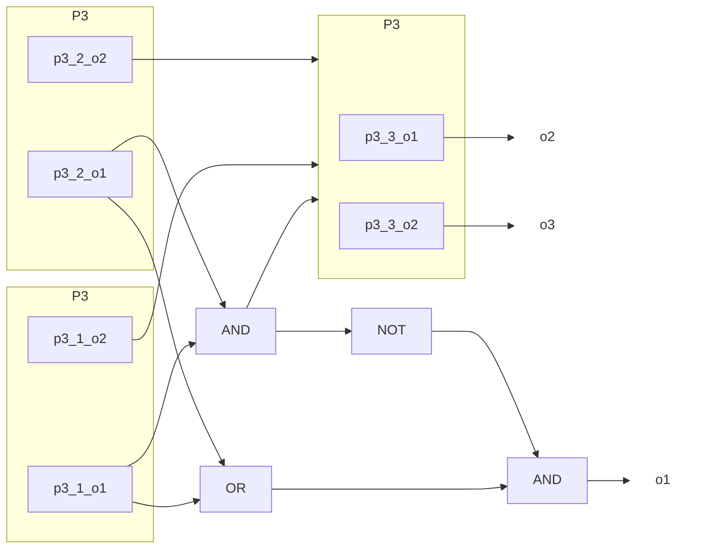

# 2019年度 創造情報学 第2問

## (1)

iビット目を取り出し、その値によってカウンタをインクリメントする。シフト演算、比較、カウンタのインクリメントのそれぞれで1単位時間がかかるため、計算時間は3n単位時間となる。

ただし、1の個数が最大でも$\log_2 n$であることを考慮すると、$2n+\log_{2}n$となる。

```python
def population_count(data: int, n: int) -> int:
    count = 0
    for i in range(n):
        if (data & (1 << i)) != 0:
            count += 1
    return count
```

## (2)

表引きの計算時間のみ考えればよいので、1単位時間でよい。

## (3)

### (3) 解答1

桁をm個に分割して表引きする。(2)ではnビットで表引きを行ったが、代わりにn/2ビットなど適当な小さい数字で表引きを行う。

```python
lookup_table = {
    0b0: 0, 0b1: 1, 0b10: 1, 0b11: 2, 0b100: 1, 0b101: 2, 0b110: 2, 0b111: 3,
    0b1000: 1, 0b1001: 2, 0b1010: 2, 0b1011: 3, 0b1100: 2, 0b1101: 3, 0b1110: 3, 0b1111: 4,
}

def population_count(data: int) -> int:
    lower_half = data & 0b1111
    upper_half = data >> 4

    return lookup_table[lower_half] + lookup_table[upper_half]

if __name__ == "__main__":
    data = 0b10101101
    n = 8
    expected = 5
    actual = population_count(data)
    assert expected == actual, f"{expected}=, {actual=}"
```

索引サイズをn/mにした場合、シフト演算にm単位時間、表引きにm単位時間、加算にm-1単位時間かかるため、計算時間は3m-1単位時間となる。

### (3) 解答2

Brian Kernighan (ブライアン・カーニンハン) のアルゴリズムを用いる。

```python
def population_count(data: int) -> int:
    count = 0
    while data != 0:
        data = data & (data - 1)
        count += 1
    return count
```

計算時間は$\log_2 n$単位時間となる。

## (4)

真理値表（2進数として見やすいよう、o2,o1の順番で配してある）

| b1  | b2  | b3  | o2  | o1  |
| --- | --- | --- | --- | --- |
| 0   | 0   | 0   | 0   | 0   |
| 0   | 0   | 1   | 0   | 1   |
| 0   | 1   | 0   | 0   | 1   |
| 0   | 1   | 1   | 1   | 0   |
| 1   | 0   | 0   | 0   | 1   |
| 1   | 0   | 1   | 1   | 0   |
| 1   | 1   | 0   | 1   | 0   |
| 1   | 1   | 1   | 1   | 1   |

回路図は次の通り。半加算器を2つ組み合わせて作った。



## (5)



## (6)

どのような遅延が問題となるかを考える。(5)の回路を組み合わせて入力12ビットのpopulation count論理回路$P_{12}$を構成する。$P_{12}$の4ビット目の演算には3ビット目の計算結果が必要になり、3ビット目には2ビット目の...と、nが大きくなるほど遅延が問題になることが分かる。

解決のため、桁上りを先取りすることが考えられる。例えば3ビット目の演算で2ビット目の計算結果を待つのではなく、考えられる組み合わせを並列で計算し、そのORを取る。

1. 3ビット目の入力がいずれも1
2. 3ビット目の入力の片方が1で、2ビット目の入力がいずれも1
3. 3ビット目, 2ビット目の入力の片方が1で、1ビット目の入力がいずれも1
