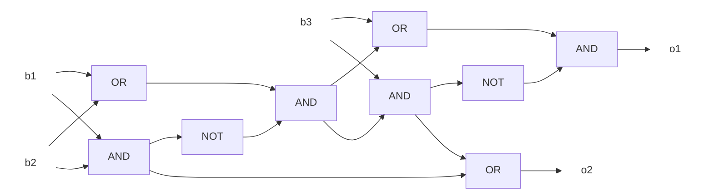
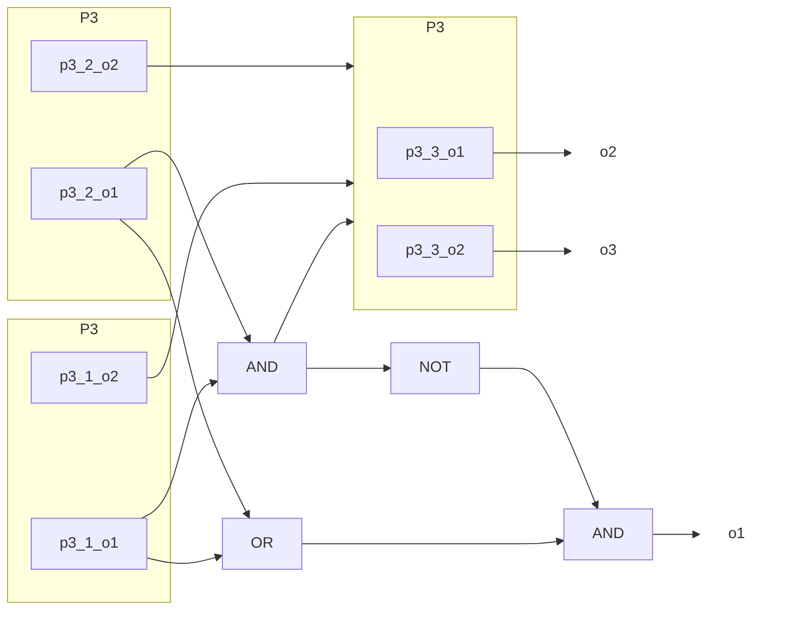

# 2019年度 創造情報学 第2問

## (1)

```python
count = 0
i = 0
while True:
    if  panel[i] != 0:
        count+= 1
    i += 1
    if i == n:
        break
```

計算時間は、パネルの値の比較と不具合のカウントで$n+\log_{2}n$単位時間となる。

## (2)

表引きの計算時間のみ考えればよいので、1単位時間でよい。

## (3)

索引のビット数が$n/2$の表を用意する。

(解答途中)

## (4)

真理値表（2進数として見やすいよう、o2,o1の順番で配してある）

| b1  | b2  | b3  | o2  | o1  |
| --- | --- | --- | --- | --- |
| 0   | 0   | 0   | 0   | 0   |
| 0   | 0   | 1   | 0   | 1   |
| 0   | 1   | 0   | 0   | 1   |
| 0   | 1   | 1   | 1   | 0   |
| 1   | 0   | 0   | 0   | 1   |
| 1   | 0   | 1   | 1   | 0   |
| 1   | 1   | 0   | 1   | 0   |
| 1   | 1   | 1   | 1   | 1   |

回路図は次の通り。半加算器を2つ組み合わせて作った。



## (5)



## (6)

どのような遅延が問題となるかを考える。(5)の回路を組み合わせて入力12ビットのpopulation count論理回路$P_{12}$を構成する。$P_{12}$の4ビット目の演算には3ビット目の計算結果が必要になり、3ビット目には2ビット目の...と、nが大きくなるほど遅延が問題になることが分かる。

解決のため、桁上りを先取りすることが考えられる。例えば3ビット目の演算で2ビット目の計算結果を待つのではなく、考えられる組み合わせを並列で計算し、そのORを取る。

1. 3ビット目の入力がいずれも1
2. 3ビット目の入力の片方が1で、2ビット目の入力がいずれも1
3. 3ビット目, 2ビット目の入力の片方が1で、1ビット目の入力がいずれも1
