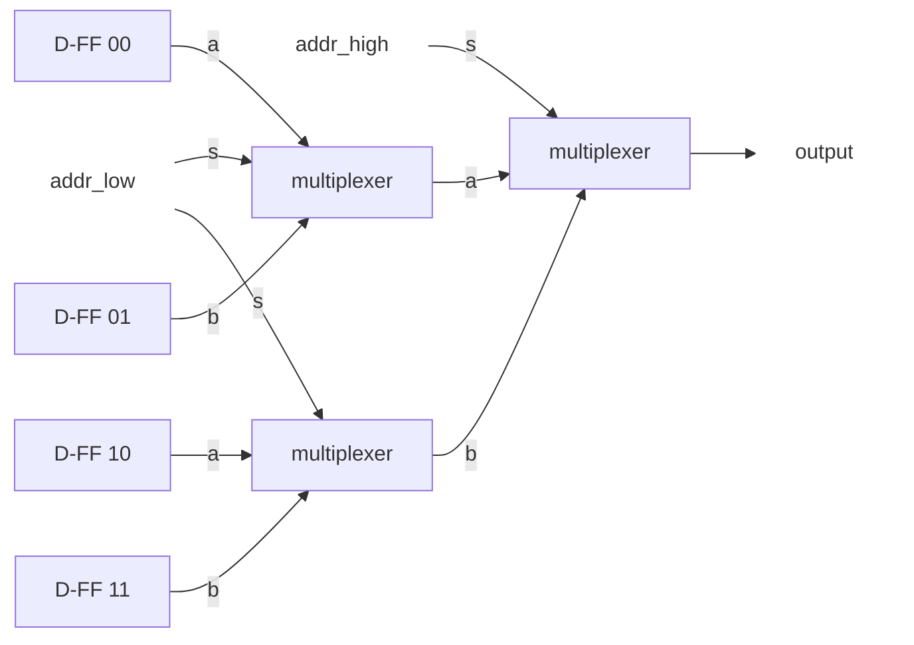
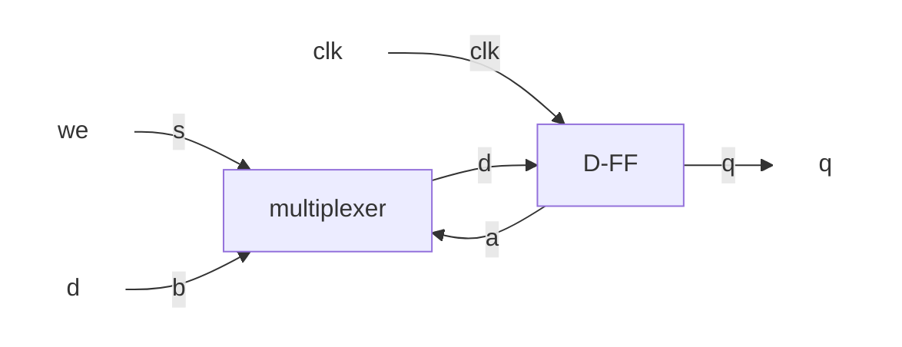
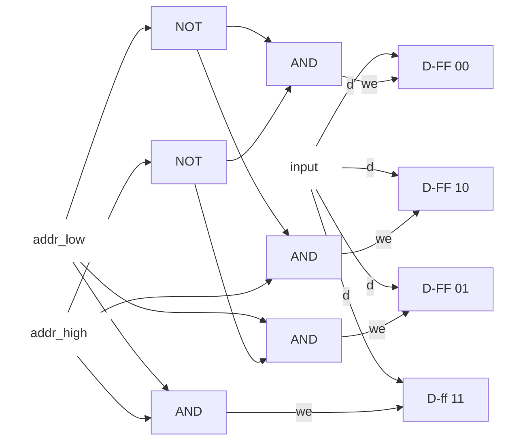

# 創造情報学 第2問

## (1)

| s   | a   | b   | c   |
| --- | --- | --- | --- |
| 0   | 0   | 0   | 0   |
| 0   | 0   | 1   | 0   |
| 0   | 1   | 0   | 1   |
| 0   | 1   | 1   | 1   |
| 1   | 0   | 0   | 0   |
| 1   | 0   | 1   | 1   |
| 1   | 1   | 0   | 0   |
| 1   | 1   | 1   | 1   |

## (2)

## (3)

次の通り、簡単に計算できる範囲で実験してみる。

1. $2^0$ビットメモリ: 0個のマルチプレクサ
2. $2^1$ビットメモリ: 1個のマルチプレクサ
3. $2^2$ビットメモリ: 3個のマルチプレクサ
4. $2^3$ビットメモリ: 7個のマルチプレクサ
5. $2^4$ビットメモリ: 15個のマルチプレクサ

実験から、$2^n$ビットのメモリアドレスの指定した位置にアクセスするには、$2^n-1$個のマルチプレクサが必要と分かる。これは、1ビット増える毎に同じ回路をもう1つ用意して新たなマルチプレクサで結合することとも整合的である。

## (4)

## (5)

