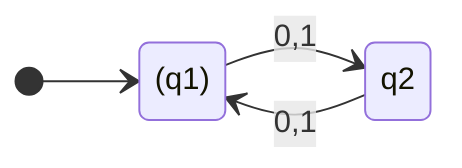
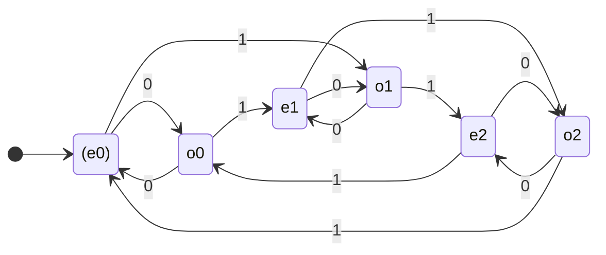
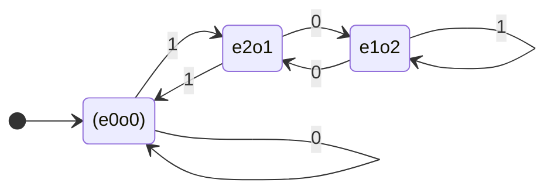
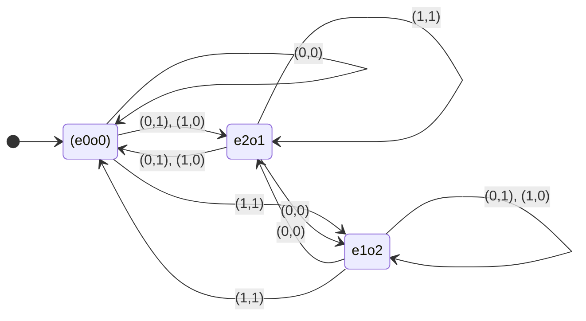

# 2023年度 創造情報学 第1問

## (1)

### (1-1)

q1

### (1-2)

010111011

### (1-3)

受理状態として指定された状態は`()`で示した。

## (2)

任意の非負整数 $a$, $b$ について、次の定理（剰余の定理）が成り立つ。

$a \bmod c = r_a$, $b \bmod c = r_b$ のとき、 $(a+b) \bmod c = (r_a+r_b) \bmod c$

剰余の定理について、次の通り証明する。

$a = q_ac+r_a$, $b = q_bc+r_b$ と表せる。$q_a$, $q_b$ は非負整数である。

$$
\begin{align}
& (a+b) \bmod c \\
=& (q_ac+r_a + q_bc+r_b) \bmod c
\end{align}
$$

ここで、任意の非負整数$q$, $r < c$に対して$(qc+r)\bmod c = r$は自明である。したがって、次の通り式を展開する。

$$
\begin{align}
& (q_ac+r_a + q_bc+r_b) \bmod c \\
=& (r_a + r_b) \bmod c
\end{align}
$$

よって剰余の定理は示された。

続いて命題を示す。命題は次の通り。

$$
\begin{align}
\nu(x_{2n-1},x_{2n-2},...,x_0) \equiv (2\sum_{i=0}^{n-1}x_{2i+1}+\sum_{i=0}^{n-1}x_{2i}) \pmod 3
\end{align}
$$

問題文の前提より、桁数は偶数である。よって、与えられた式の右辺を次の通り展開できる。

$$
\begin{align}
& \nu(x_{2n-1},x_{2n-2},...,x_0) \\
=& \nu(x_{2n-1},0,x_{2n-3},...,0,x_1,0) + \nu(0,x_{2n-2},0,...,0,x_0) \\
=& \sum_{i=0}^{n-1}2^{2i+1}x_{2i+1} + \sum_{i=0}^{n-1}2^{2i}x^{2i}
\end{align}
$$

続いて、展開した式の左辺について、次の式（2進数の偶数桁目の総和と、偶数桁目の1のビット数の2倍は、3を法として合同）を証明する。

$$
\begin{align}
\sum_{i=0}^{n-1}2^{2i+1}x_{2i+1} \equiv 2\sum_{i=0}^{n-1}x_{2i+1} \pmod 3
\end{align}
$$

両辺が共に総和であるため、次の式を示すことで前式が示せる。

$$
\begin{align}
2^{2i+1}x_{2i+1} \equiv 2x_{2i+1} \pmod 3
\end{align}
$$

$x_{2i+1} = 0$ のとき自明である。

$i=0$ のとき、$2^{2i+1} 1 \bmod 3 = 2$  で自明である。$x_{2i+1} = 1$ かつ $i\ge1$ のときを考える。

$i\ge1$ のとき、$i-1$ について $2^{2(i-1)+1} \bmod 3 = 2$ なら $i$ についても同様である。次の通り示す。$q$ は整数である。

$$
\begin{align}
2^{2(i-1)+1} \bmod 3 &= 2 \\
2^{2(i-1)+1} &= 3q + 2 \\
2^{2i+1} &= 12q + 8 \\
2^{2i+1} &= 3(4q + 2) + 2 \\
\end{align}
$$

よって帰納法により、2進数の偶数桁目の総和と、偶数桁目の1のビット数の2倍は、3を法として合同である。

続いて、展開した式の右辺についても、同様に次の式（2進数の奇数桁目の総和と、奇数桁目の1のビット数は、3を法として合同）を証明する。

$$
\begin{align}
\sum_{i=0}^{n-1}2^{2i}x_{2i} \equiv \sum_{i=0}^{n-1}2^{2i}x^{2i} \pmod 3
\end{align}
$$

両辺が共に総和であるため、次の式を示すことで前式が示せる。

$$
\begin{align}
2^{2i}x_{2i} \equiv x_{2i} \pmod 3
\end{align}
$$

$x_{2i} = 0$ のとき自明である。

$i=0$ のとき、$2^{2i} 1 \bmod 3 = 1$  で自明である。$x_{2i} = 1$ かつ $i\ge1$ のときを考える。

$i\ge1$ のとき、$i-1$ について $2^{2(i-1)} \bmod 3 = 1$ なら $i$ についても同様である。次の通り示す。

$$
\begin{align}
2^{2(i-1)} \bmod 3 &= 1 \\
2^{2(i-1)} &= 3q + 1 \\
2^{2i} &= 12q + 4 \\
2^{2i} &= 3(4q + 1) + 1 \\
\end{align}
$$

よって帰納法により、2進数の奇数桁目の総和と、奇数桁目の1のビット数は、3を法として合同

したがって、次の通り題意は示された。

$$
\begin{align}
& \nu(x_{2n-1},x_{2n-2},...,x_0) \\
=& \sum_{i=0}^{n-1}2^{2i+1}x_{2i+1} + \sum_{i=0}^{n-1}2^{2i}x^{2i} \\
\equiv& (2\sum_{i=0}^{n-1}x_{2i+1}+\sum_{i=0}^{n-1}x_{2i}) \pmod 3
\end{align}
$$

## (3)

読み取った数値の3を法とした和の余りの状態と、現在の桁数の情報を持てば良さそうだ。これは与えられた条件である「状態数は6とする」合致する。

## (4)

## (5)

