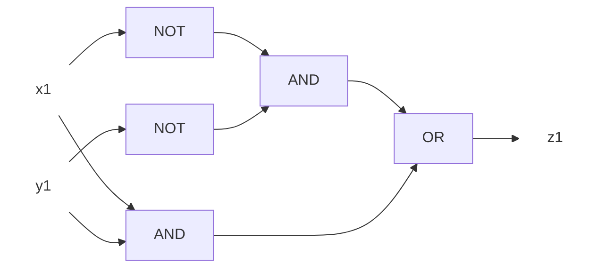
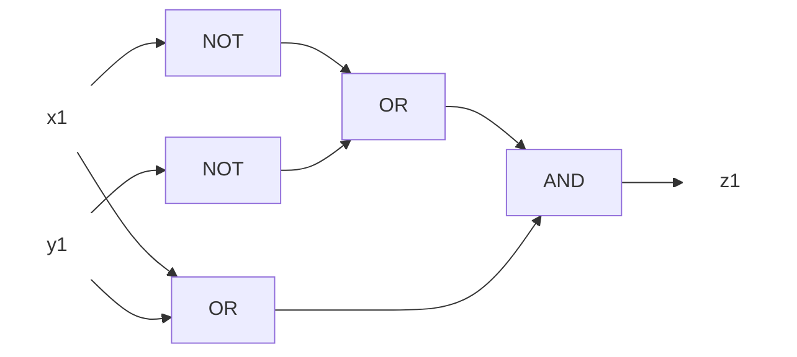
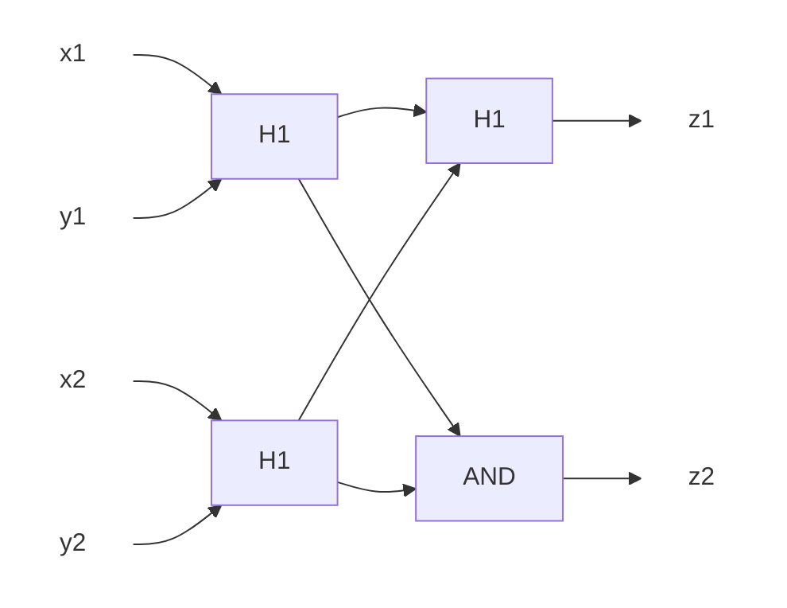
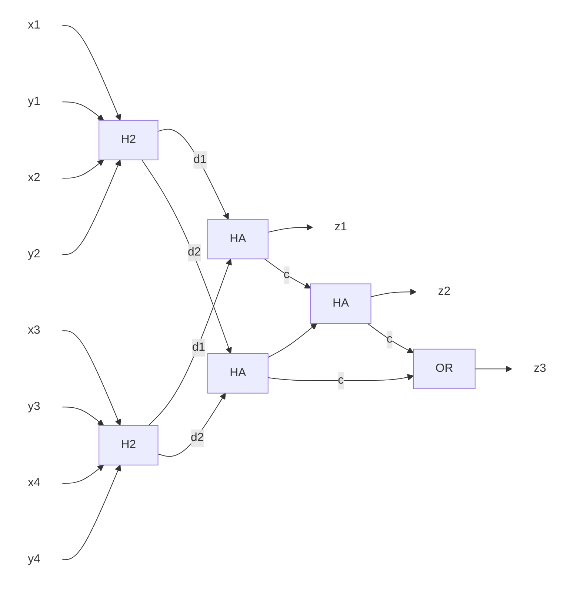

# 創造情報学 第2問

簡潔データ構造の導入的な問題。定兼先生の[簡潔データ構造](https://amzn.to/3XFVkEb)を参照すると、どのような問題設定からこうしたアルゴリズムが求められているか理解が深まる。

## (1)

各データのハミング距離は次の通り。

1. データID1: 2
2. データID2: 1
3. データID3: 4

## (2)

表引きにかかる時間計算量、空間計算量を測る問題。ルックアップテーブルの仕様が与えられていない。（そして、ルックアップテーブルといえばどのような仕様を指すかの決まりごとも見つけられなかった）

よって、解答内で前提を示せれば良いものと仮定して進める。また空間計算量についても平均で考える。

ルックアップテーブルとして、ビット列を索引とし、かつビット列を2進数と見做して整列させた表を想定する。表はビット列の可能な組み合わせがすべて含まれる（つまりbによってサイズが定まる）。表の値は、そのビット列を持つデータIDのリストである。

これは静的ハッシュテーブルと見做せるため、平均時間計算量は定数時間$O(1)$となる。

次に表の行数は$O(2^b)$となる。また、IDを収めたリストのリストの大きさは$N$である。よって、空間計算量は$O(2^b + N)$となる。

## (3)

分割したルックアップテーブルをA,Bとする。A,BそれぞれからIDのリストを出力する検索は、$O(1) * 2 = O(1)$となる。A,Bから出力したIDのリストをそれぞれ$A_0$,$B_0$とする。$A_0$,$B_0$の平均サイズは$\frac{N}{2^{\frac{b}{2}}}$である。$A_0$,$B_0$に共通する要素を抽出する作業は、2重ループとなるため$(\frac{N}{2^{\frac{b}{2}}})^2=\frac{N^2}{2^b}$となる。

よって、平均時間計算量は$O(\frac{N^2}{2^b})$となる。

空間計算量は$O(2^{\frac{b}{2}} + N)$となる。

## (4)

A,Bのそれぞれから、与えられたクエリデータとのハミング距離が0と1のIDをリストアップし、その集合をそれぞれ$A_0$,$A_1$,$B_0$,$B_1$とする。$A_0\&B_0$, $A_0\&B_1$, $A_1\&B_0$が求めているIDである。

ビット列の長さが$2^{\frac{b}{2}}$のとき、与えられたクエリに対してハミング距離が1の組み合わせは$2^{\frac{b}{2}}$である。それらの突合にかかる平均時間計算量は、(3)と同じく$\frac{N^2}{2^b}$である。

よって、平均時間計算量は$O(2^{\frac{b}{2}}+\frac{N^2}{2^b})$となる。

## (5)

真理値表は次の通り。

| X   | Y   | Z   |
| --- | --- | --- |
| 0   | 0   | 0   |
| 0   | 1   | 1   |
| 1   | 0   | 1   |
| 1   | 1   | 0   |

デジタル回路は次の通り。なお、XOR回路と見なせる。

AND-ORで設計した場合。

OR-ANDで設計した場合。

## (6)

## (7)

