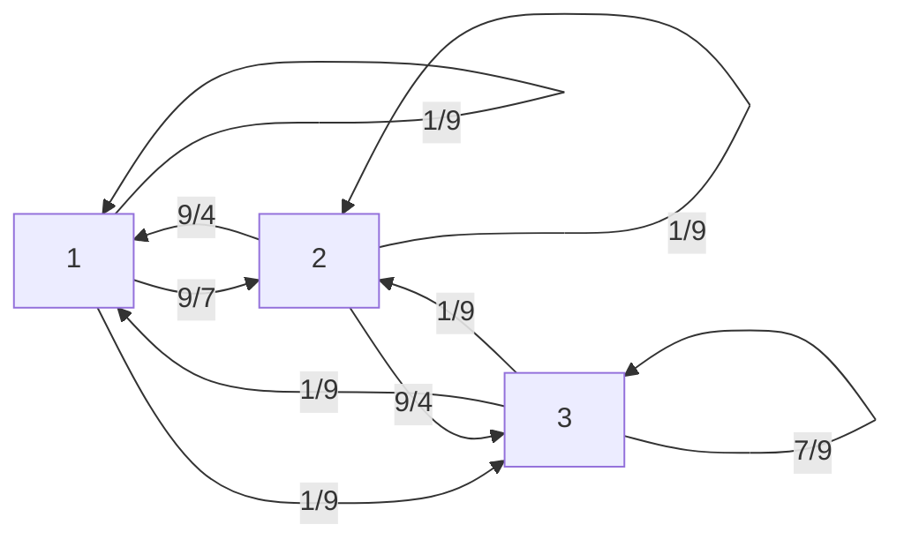

# 2025年度 創造情報学 第1問

マルコフ連鎖と線形代数に関する問題。

状態確率を次のとおりとする。

$$
\begin{align}
P=(P^{(t)}_1,P^{(t)}_2, P^{(t)}_3)^T \\
P_0 = (1,0,0)^T
\end{align}
$$

## (1)

$P^{(1)}, P^{(2)}$ を求める。

$$
P^{(1)} = (0,1,0)^T , P^{(2)} = (0.5, 0, 0.5)^T
$$

## (2)

$t$を使って$P^{(t)}_1, P^{(t)}_2$ を書き表す。

$$
\begin{align}
P^{(t)}_1 = P^{(t-1)}_2 * 0.5 \\
P^{(t)}_2 = P^{(t-1)}_1 * 1
\end{align}
$$

## (3)

定常状態を示す。

$$
P^{\infin} = (0,0,1)^T
$$

## (4)

確率$\alpha$でいずれかのページに等確率で遷移する。$\alpha = 1/3$の時、状態遷移行列と状態遷移図を示せ。

(状態遷移行列は省略)

## (5)

定常状態を示す。

(省略)

## (6)

ペロン=フロベニウスの定理を用いた証明問題。

(未回答)

## (7)

(未回答)

## (8)

(未回答)
