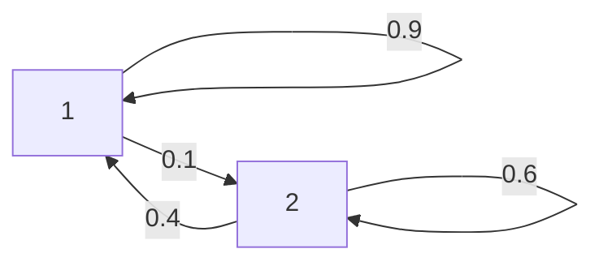

# 2024年度 電子情報学 第5問

## (1)

## (2)

マルコフ過程の定常状態を求める問題（と難しく言わなくても連立方程式を立てれば解ける）。

$$
\begin{bmatrix}
0.9 & 0.4\\
0.1 & 0.6
\end{bmatrix}
\begin{bmatrix}
P(0) \\
P(1)
\end{bmatrix} =
\begin{bmatrix}
P(0) \\
P(1)
\end{bmatrix}
$$

$$
P(0) = 0.8, P(1) = 0.2
$$

## (3)

ここでエントロピーとは情報源に関する平均エントロピーであり、要するに確率と情報量の積和となる。

エントロピーの公式は次の通り。

$$
H = - \sum_{i}P(x_i) \log_b P(x_i)
$$

次の通り解く。なお、問題文より$log_2 5 = 2.32$を利用する。

$$
\begin{align}
H &= - (0.8 \log_2 \frac{4}{5} + 0.2 \log_2 \frac{1}{5}) \\
&= - (0.8 (\log_2 4-\log_2 5) - 0.2 \log_2 5) \\
&= - (0.8 * (-0.32) - 0.2 * 2.32) \\
&= - (-0.26 - 0.46) \\
&= 0.72 \\
\end{align}
$$

## (4) ~ (9)

(未回答)
