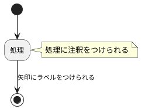

# アクティビティ図

順次・分岐・繰り返しの3つで処理の流れを表現する図。  
業務フローやユースケースなどを表現するために使用してもよい。  
オブジェクト指向設計ではオブジェクト内での処理フローを検討する際に用いる点がプロセス中心設計のフローチャートと異なる。  

# 参考
[PlantUML - アクティビティ図](http://plantuml.com/activity-diagram-legacy)