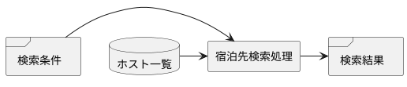

# IPO
システムをInput, Process, Outputに分けて分析するやり方、およびそのための記述。  
プロセス中心アプローチで機能ごとの処理の検討をする際に用いられることがある。

# 参考
[Wikipedia - IPO_model](https://en.wikipedia.org/wiki/IPO_model)
[インフォテック - ソフトウェア設計手法](https://www.infotech-s.co.jp/syuppan/pdf/04.pdf)