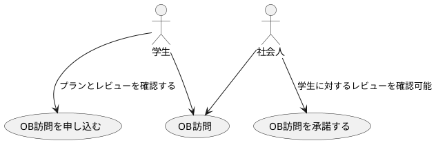

# ユースケース図

アクターとユースケースの関連を表現する図。  
ユースケースの詳細を表現するためには、記述を作成したりロバストネス分析を行うことがある。  

# ユースケース
要件定義フェーズで洗い出し、主要なものについてはシナリオを作成しておく。  
外部設計フェーズで詳細化および、全てのユースケースに対してシナリオの作成を行う。このとき、複数のユースケースに共通のビジネスルールは別に抜き出すと良い。  

# 参考
[PlantUML - ユースケース図](http://plantuml.com/use-case-diagram)