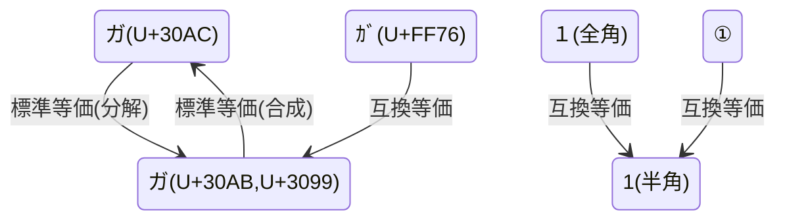

# カタカナ

```shell
deno run regex.ts
```

## 正規化



```shell
deno test
```

## Reference

- [Katakana (Unicode block) - Wikipedia](https://en.wikipedia.org/wiki/Katakana_(Unicode_block))
- [りいんちゃん: 「私がUnicodeの文字関係の日本語のツールなど参考にしているのは次のWebサイトです。...」 / Twitter](https://twitter.com/reinforchu/status/1584035171820785665)
- [Unicode一覧表](http://www.shurey.com/js/works/unicode.html) 逆引きができて便利
- [Unicode（コード順索引） - CyberLibrarian](https://www.asahi-net.or.jp/~ax2s-kmtn/ref/unicode/index_u.html)
